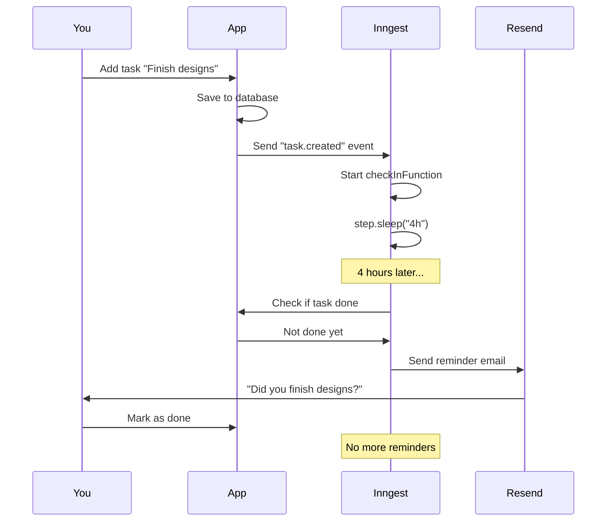

# Accountability Buddy

A simple app that helps you stay accountable to your daily goals. Set a task, and we'll check in on you after a specified time to see if you completed it.

## What It Does

1. **Add a task** - What do you want to accomplish today?
2. **Set check-in time** - When should we remind you? (2 min, 1 hour, 4 hours, 12 hours, or 24 hours)
3. **Get reminded** - After the time passes, you'll receive an email asking if you finished
4. **Mark as done** - If you complete it, mark it done and no more reminders!

## Tech Stack

- **Next.js 16** - React framework with App Router
- **Inngest** - Workflow engine for delayed check-ins (the learning focus!)
- **Vercel Postgres** - Database for storing tasks
- **Resend** - Email service for reminders
- **shadcn/ui** - Beautiful UI components
- **Tailwind CSS** - Styling

## Key Learning: Inngest

This project is designed to teach you **Inngest** - a powerful workflow engine. You'll learn:

- How to create durable workflows that survive server restarts
- Using `step.sleep()` to pause execution for hours/days
- Using `step.run()` for automatic retries
- Sending events to trigger functions
- Testing workflows locally with Inngest dev server

## Getting Started

**👉 See [SETUP.md](./SETUP.md) for complete setup instructions!**

Quick start:

1. Set up Vercel Postgres database
2. Run the migration in `migrations/001_create_tasks_table.sql`
3. Get a Resend API key
4. Configure `.env.local`
5. Run `npm run dev`
6. Run `inngest dev` (in another terminal) for local testing

## Project Structure

```
accountability-buddy/
├── app/
│   ├── api/
│   │   ├── tasks/          # Task CRUD endpoints
│   │   └── inngest/        # Inngest webhook
│   ├── page.tsx            # Main UI
│   └── layout.tsx          # App layout
├── lib/
│   ├── db.ts               # Database functions
│   ├── inngest.ts          # Inngest functions (YOUR LEARNING FOCUS!)
│   └── utils/              # Helper functions
├── components/
│   └── ui/                 # shadcn/ui components
├── migrations/             # Database schema
└── SETUP.md                # Complete setup guide
```

## How It Works



## Development

```bash
# Install dependencies
npm install

# Run Next.js dev server
npm run dev

# Run Inngest dev server (in another terminal)
inngest dev
```

Visit:

- App: http://localhost:3000
- Inngest Dashboard: http://localhost:8288

## Deployment

See [SETUP.md](./SETUP.md) for detailed deployment instructions to:

- Vercel (hosting)
- Inngest Cloud (workflows)

## License

MIT
